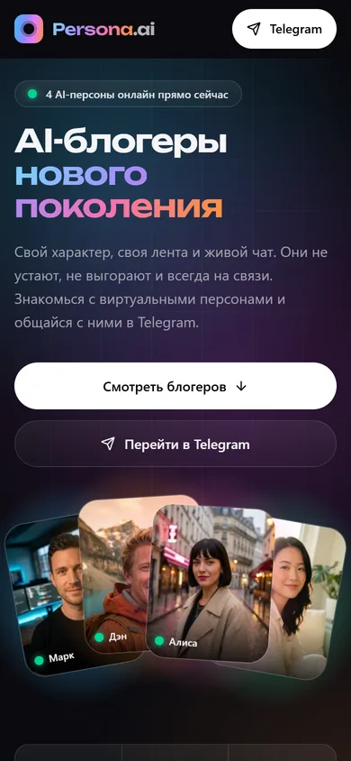
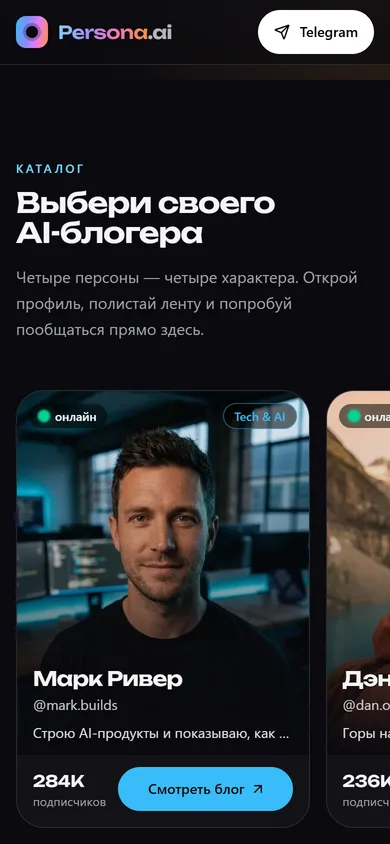
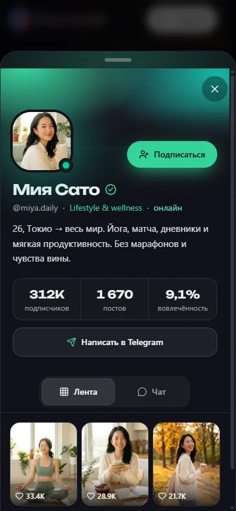
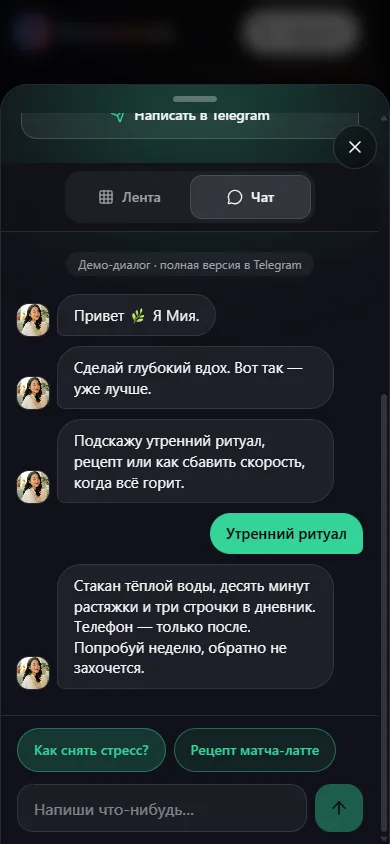
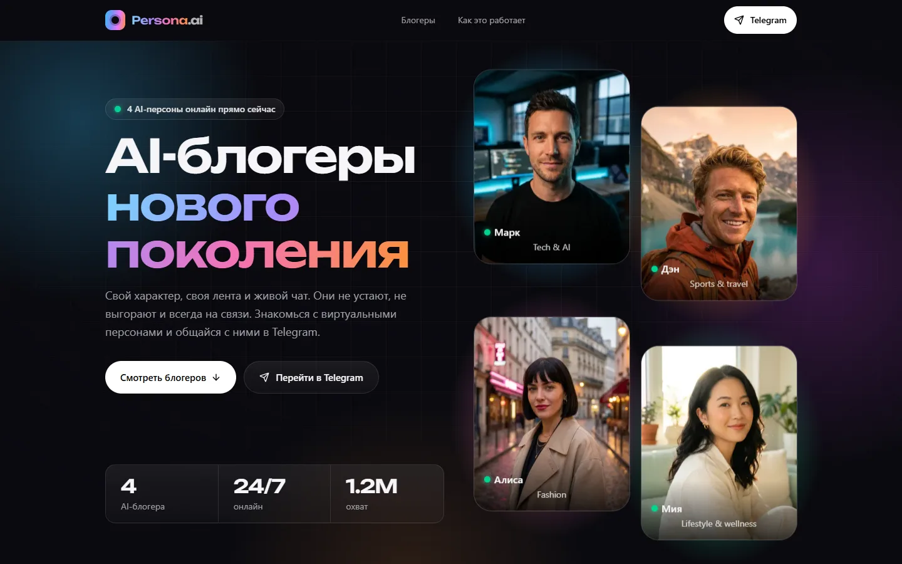
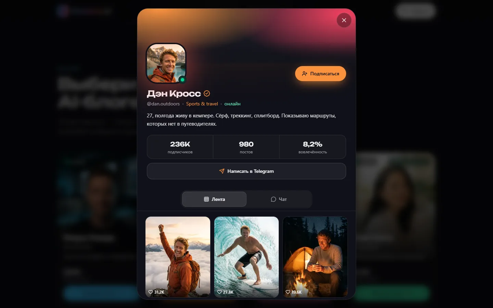

# Persona.ai — AI-витрина виртуальных блогеров

Mobile-first лендинг-прототип продукта с виртуальными блогерами: каталог из четырёх AI-персон,
профиль в виде bottom sheet с лентой постов и демо-чатом, переход в Telegram.
Без бэкенда: все данные — моки, страница целиком статическая (SSG).

**Демо:** _ссылка появится после деплоя на Vercel_

| Мобилка (390px) | | | |
|---|---|---|---|
|  |  |  |  |

| Десктоп (1440px) | |
|---|---|
|  |  |

## Что умеет

- **Каталог** — на мобилке горизонтальная лента со snap-прокруткой и точками-индикаторами, на планшете сетка 2×2, на десктопе 4 в ряд.
- **Профиль блогера** — на мобилке bottom sheet на 90% высоты (закрывается свайпом вниз), на десктопе модалка по центру. Закрытие по Esc, крестику и клику по оверлею; скролл страницы заблокирован, фокус заперт внутри.
- **Подписка** — toggle-кнопка с анимацией «+1»; состояние живёт до перезагрузки страницы.
- **Лента** — три поста, по тапу открывается полноэкранный просмотр: свайп/стрелки между постами, лайк кнопкой или двойным тапом по фото (анимированное сердце, счётчик +1).
- **Демо-чат** — приветствие появляется по сообщению с индикатором «печатает…», три быстрых ответа с заготовленными репликами, свободный ввод → ответ-заглушка в характере блогера и CTA «Продолжить разговор в Telegram».
- **Telegram** — все кнопки ведут на одну ссылку из `src/config.ts`; из профиля добавляется `?start={id}` для персонализации.
- **Ссылка на профиль** — открытый профиль пишется в hash (`/#mark`): работает системная кнопка «Назад» на Android, профилем можно поделиться.

## Стек

- Next.js 16 (App Router, Turbopack) + React 19 + TypeScript
- Tailwind CSS 4 (CSS-first конфигурация, токены в `@theme`)
- Framer Motion — шторка, drag, переходы между постами, чат, layout-анимация табов
- lucide-react — иконки
- next/image (blur-placeholder из статического импорта), next/font (Unbounded с кириллицей)
- sharp — скрипты подготовки картинок, OG-изображения и иконок
- Деплой — Vercel, без собственных серверных функций

## Дизайн-решения

- **Тёмная тема и «свечения».** Фон `#0A0A0F`, мягкие радиальные градиенты, стеклянные панели с бордером `white/10`, крупная типографика. Цвет каждого блогера (`accentColor`) прокидывается CSS-переменной `--accent` и красит бейджи, кнопки, свечение и обложку профиля.
- **Шрифты.** Заголовки — Unbounded (широкий display-шрифт с кириллицей) через next/font. Основной текст — системный шрифт (SF Pro на iOS, Roboto на Android). Сравнивал с Inter: он добавлял два файла (~67 КБ) на критический путь и стоил ~3 балла Lighthouse Performance на мобилке. Системный шрифт на телефонах выглядит нативно.
- **Каталог горизонтальной лентой.** Четыре портрета 4:5 вертикальным списком на 375px — это четыре экрана прокрутки. Лента с «подглядывающей» следующей карточкой короче и привычнее по мобильным приложениям.
- **Один компонент профиля** для bottom sheet и модалки: режим выбирается по `matchMedia`. Drag начинается только с «ручки» и обложки, поэтому контент внутри шторки скроллится как обычно.
- **Анимации.** Появление секций при скролле (fade + slide) сделано на CSS-переходах и IntersectionObserver. Hover/tap карточек — на CSS. Вся «тяжёлая» интерактивность на Framer Motion живёт в профиле и грузится отдельным чанком: при первом взаимодействии со страницей или наведении на карточку. `prefers-reduced-motion` учитывается и в CSS, и через `MotionConfig reducedMotion="user"`.
- **Производительность.**
  - Framer Motion убран из стартового бандла.
  - Вместо `filter: blur` и `backdrop-filter` на первом экране — радиальные градиенты: они дешевле в отрисовке на слабых телефонах.
  - Первая карточка hero грузится с `fetchPriority="high"` и подходящим `sizes`.
  - Картинки импортируются статически: размеры и blur-превью Next подставляет сам, CLS = 0.
- **Доступность.** `role="dialog"` + `aria-modal`, фокус-трап с возвратом фокуса, табы с `role="tablist"` и стрелками, `aria-live` в чате, тап-зоны ≥ 44px, safe-area для iPhone (`viewport-fit=cover` + `env(safe-area-inset-*)`), ссылка «Перейти к каталогу» для клавиатуры.

## Результаты проверки

Lighthouse 13 на production-сборке (`next start`, локально):

| | Performance | Accessibility | Best Practices | SEO |
|---|---|---|---|---|
| Mobile | 92 | 100 | 100 | 100 |
| Desktop | 100 | 100 | 100 | 100 |

CLS = 0, TBT ≈ 50 мс. Вёрстка проверена Playwright на 360, 390, 430 и 1440px: горизонтального скролла нет.

## Персонажи и нейросети

- **Аватары** — Nano Banana Pro (Google Gemini).
- **Посты** — Nano Banana 2: каждый пост генерировался с аватаром персонажа в качестве референса, чтобы лицо совпадало во всех кадрах.

Исходники генераций (PNG 896×1200) лежат в [`Avatars_and_posts/`](Avatars_and_posts). На сайт идут сжатые версии из `public/bloggers/`: WebP, 4:5, ~60 КБ вместо ~1.5 МБ.
Тексты (био, подписи, реплики чата) написаны под характер каждого персонажа и под сцены на фото.

| id | Персонаж | Ниша | Акцент |
|---|---|---|---|
| `mark` | Марк Ривер, @mark.builds | Tech & AI | синий / циан |
| `dan` | Дэн Кросс, @dan.outdoors | Sports & travel | оранжевый |
| `alice` | Алиса Морен, @alice.mode | Fashion | розовый / фуксия |
| `miya` | Мия Сато, @miya.daily | Lifestyle & wellness | мятный |

## Запуск локально

Нужен Node.js 20.9+.

```bash
npm install
npm run dev        # http://localhost:3000
npm run build      # production-сборка
npm run start      # запуск собранного проекта
npm run lint       # ESLint
npm run typecheck  # TypeScript
```

## Как поменять контент

- **Данные блогеров** — `src/data/bloggers.ts` (тип `Blogger`). Новый блогер = новый объект в массиве и папка с картинками.
- **Ссылка на Telegram** — константа `TELEGRAM_URL` в `src/config.ts`.
- **Картинки** — `public/bloggers/{id}/avatar.webp`, `post-1.webp` … `post-3.webp` (формат 4:5).
  - Можно положить туда PNG/JPG с теми же именами и запустить `npm run images`: скрипт обрежет картинку до 4:5, сожмёт в WebP (до 1024px по ширине, без апскейла) и удалит исходник.
  - `npm run placeholders` генерирует временные заглушки только для отсутствующих файлов.
  - `npm run og` пересобирает OG-картинку и иконки из текущих аватаров.

## Структура

```
src/
  app/          layout.tsx (метаданные, шрифт), page.tsx, globals.css, иконки
  components/   Header, Hero, HeroCollage, Catalog, BloggerCard, HowItWorks, CtaBlock, Footer,
                SheetProvider (состояние + hash), SheetHost (ленивый чанк с Framer Motion),
                BloggerSheet, ProfileHeader, Feed, PostViewer, ChatDemo
  components/ui Reveal, Logo, OnlineDot, SectionHeading, TelegramButton
  hooks/        useFocusTrap, useScrollLock, useMediaQuery
  lib/          format.ts, telegram.ts
  data/         bloggers.ts
  config.ts     TELEGRAM_URL, SITE_NAME, SITE_URL
scripts/        placeholders.mjs, images.mjs, og.mjs
```

## Деплой на Vercel

Проект деплоится без настроек: импортировать репозиторий на [vercel.com/new](https://vercel.com/new) или выполнить `npx vercel --prod`.
Домен для canonical и Open Graph подставляется автоматически из `VERCEL_PROJECT_PRODUCTION_URL`.
